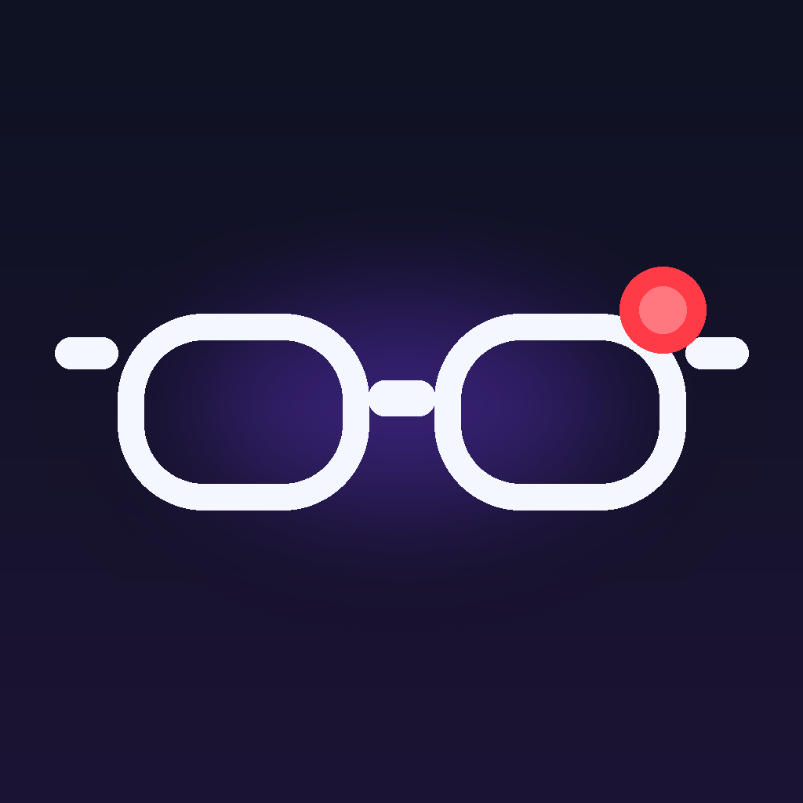
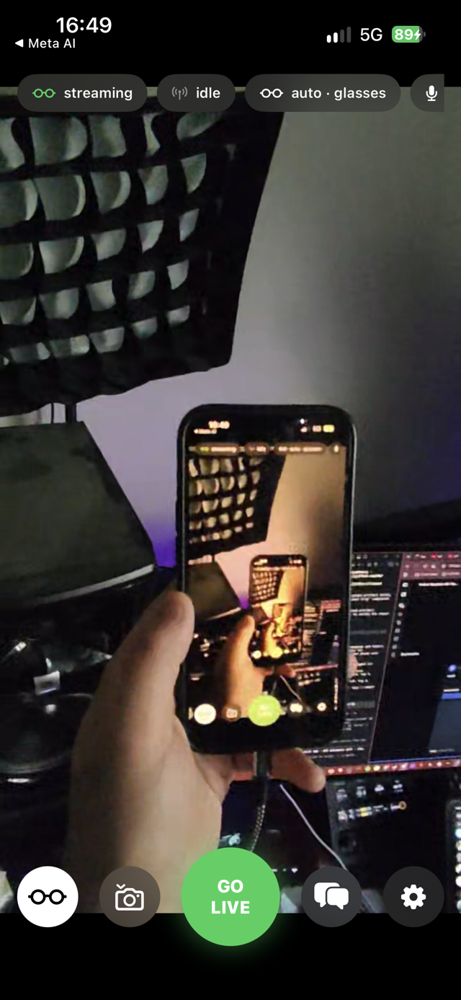
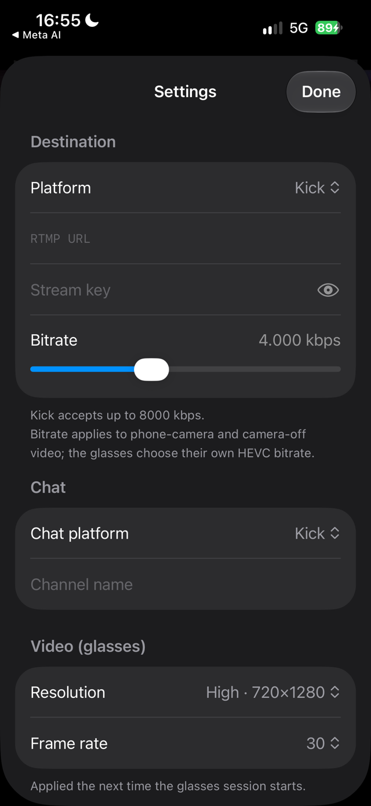
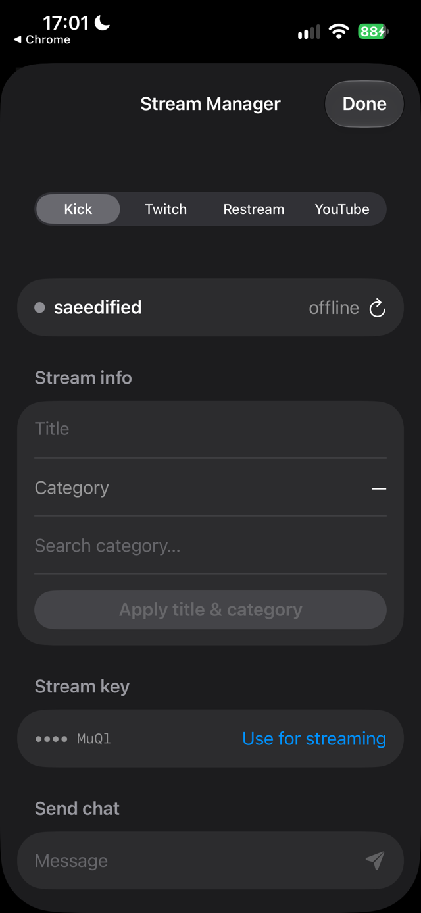
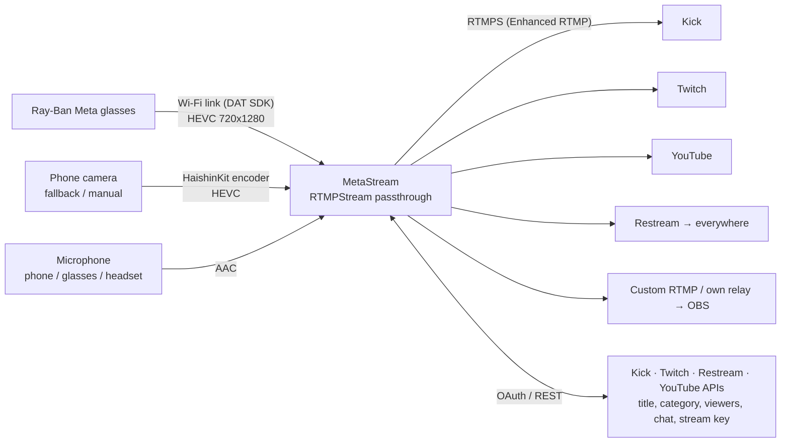

<p align="center">
  
</p>

<h1 align="center">MetaStream</h1>

<p align="center">
  IRL streaming from <b>Ray-Ban Meta</b> glasses to Kick, Twitch, YouTube, Restream or any RTMP server,<br>
  with chat, a stream manager and a phone-camera fallback. Built and signed from <b>Windows</b>. No Mac needed.
</p>

<p align="center">
  <a href="https://github.com/saeedkolivand/meta-stream/actions/workflows/build.yml"></a>
  
  
  
</p>

<p align="center">
  
  
  
</p>

---

## Why this exists

The apps that can talk to Meta glasses (StreamHand, MetaLens) don't show chat, drop the glasses the moment you
switch apps, and can't manage your broadcast. The apps that do all that (Streamlabs) can't see the glasses.
MetaStream fills that gap. I wrote it for my own streams and published it so others can build their own copy.

## What it does

| | |
|---|---|
| **Glasses video** | Meta's *Wearables Device Access Toolkit* hands the app the glasses' camera as compressed HEVC, 720×1280 at up to 30 fps |
| **Streams in the background** | Check chat, answer a text or open Maps while the stream keeps running |
| **Picture in Picture** | Leaving the app puts the feed in a floating window. That window is also what keeps a transcoded stream running once the app is no longer in front |
| **Codec handling** | The glasses' HEVC goes out untouched where the destination accepts it. Where it doesn't, the phone decodes and re-encodes to H.264 |
| **Phone-camera fallback** | When the glasses drop, the back or front camera takes over within 2 seconds and the stream does not restart. You can also switch by hand |
| **Chat** | Kick, Twitch, YouTube or Restream chat in a sheet that slides over the preview |
| **Chat read aloud** | Kick chat spoken through the glasses' open-ear speakers, so you never take the phone out. Three priority lanes: stream warnings interrupt, alerts queue, chat drops oldest when it floods |
| **Tells you when it drops** | Reconnects with backoff, speaks "stream dropped" and "stream back" with a haptic, escalates if it stays down, and turns the timer amber rather than counting dead air as airtime |
| **Health warnings** | Phone battery, phone thermal and glasses thermal, spoken once each when they cross a threshold |
| **Stream Manager** | Sign in to Kick, Twitch, Restream and YouTube inside the app to edit the title and category, watch the viewer count, send chat, pull your stream key, and switch Restream destinations on and off |
| **Destinations** | Presets for Kick, Twitch, YouTube and Restream, plus Instagram, TikTok and any RTMP, RTMPS or SRT server |
| **SRT** | Paste an `srt://` URL and it publishes over SRT instead, which survives packet loss far better on cellular. Sends HEVC untouched, so it also streams in the background without the floating window |
| **Phone camera quality** | 720p or 1080p, portrait 9:16 or landscape 16:9, 24/30/60 fps — so the app is fully useful without glasses |
| **Controls** | Go live and end, mic mute, camera off as black frames, photo capture to Photos, resolution, frame rate, bitrate, microphone picker, keep awake, and a heads-up display with fps, kbps and the stream timer |
| **Logs** | Every API call, stream event and decoder error lands in Settings → Logs with a share button. Stream keys and tokens are masked before anything is written |

### Limits you should know

- **720×1280 portrait at 30 fps is the ceiling for the glasses.** The SDK offers nothing higher to
  any third-party app. The phone camera is not limited by this: it does 720p or 1080p, portrait or
  landscape, at 24/30/60 fps.
- **The glasses choose their own bitrate**, which measured 450 to 600 kbps at 720p30. The bitrate slider only affects video the phone encodes, meaning the fallback camera and transcoded output.
- **Background streaming without the floating window works only for HEVC destinations.** Anything transcoded needs Picture in Picture open, because iOS stops the hardware decoder once the app leaves the screen.
- **A paid Apple Developer team is required** to build. See [Why a paid Apple team](#why-a-paid-apple-team).
- The glasses keep one third-party app registered at a time, so registering MetaStream unregisters StreamHand or whatever else you used.
- **Glasses battery is not readable by third-party apps.** DAT 0.9's `DeviceState` exposes only
  `thermalLevel`, so the app can warn that the glasses are hot but never that they are nearly flat.
- The glasses microphone runs over Bluetooth HFP at 8 kHz. The phone mic is the default, and any input can be picked in Settings.

## Which codec goes where

Tested against each ingest, not taken from marketing pages:

| Destination | Takes HEVC | What the app sends |
|---|---|---|
| Your own RTMP server | yes, if your server decodes it | HEVC, untouched |
| YouTube | yes, over enhanced RTMP | HEVC, untouched |
| Kick | no | H.264 from the phone |
| Restream over RTMP | no, only over SRT | H.264 from the phone |
| Any `srt://` ingest | yes | HEVC, untouched |
| Twitch | Affiliates and Partners only | H.264 from the phone |
| Instagram, TikTok | no | H.264 from the phone |

Auto follows this table, and Settings lets you override it per stream. Two things come with transcoding. Going live takes a second or two longer, because the decoder waits for a keyframe before connecting, and the stream pauses in the background unless the Picture in Picture window is up.

## How it works



Everything is one SwiftUI app: `Streamer.swift` (glasses + RTMP + fallback), `Platforms.swift` (logins and APIs),
`ContentView.swift` / `SettingsView.swift` / `StreamManagerView.swift` (UI). There is no server. Platform tokens
stay on the phone.

---

## Build your own copy

You need: a pair of Ray-Ban Meta (Gen 1/2, Display, Oakley Meta), an iPhone on iOS 17.2+, the Meta AI app, a
GitHub account, and access to a **paid Apple Developer team** (yours, or a friend who exports a development
certificate for you). No Mac is required at any point. GitHub's macOS runners do the compiling.

### 1. Fork and rename

Fork this repo. Pick a bundle ID (**no hyphens**, Meta rejects them) and replace `com.saeedkolivand.metastream` in
`project.yml`, `MetaStream/Info.plist` and `MetaStream/Platforms.swift`. Replace `metastream.iamsaeed.dev` in
`Platforms.swift` with your redirect page host (step 5).

### 2. Meta Wearables Developer Center

1. Sign up at <https://wearables.developer.meta.com> and create a project. Bundle ID = yours, Apple Team ID = the paid
   team's ID, Universal link = `metastream://`. Enable the **Camera** permission with a rationale.
2. Copy **MetaAppID** and **ClientToken** (shown under *Application ID*).
3. In the Meta AI app: *Settings → App Info → tap the version 5× → Developer Mode on*. Glasses firmware ≥ v126, Meta AI ≥ V282.

### 3. Apple signing (the paid-team part)

In <https://developer.apple.com/account> → Certificates, Identifiers & Profiles:

1. **Devices** → register your iPhone's UDID (`pip install pymobiledevice3` → `pymobiledevice3 usbmux list`).
2. **Identifiers** → App ID with your bundle ID; enable **Access Wi-Fi Information** and **Hotspot**.
3. **Profiles** → *iOS App Development* profile for that App ID, your device, an Apple Development certificate → download.
4. Export that certificate **with its private key** from Keychain Access as a `.p12`.

### 4. Platform apps (optional, one per platform you want in Stream Manager)

| Platform | Where | Settings |
|---|---|---|
| Kick | kick.com → Settings → Developer (2FA required) | Redirect `https://<your-redirect-host>/oauth.html`, all scopes |
| Twitch | <https://dev.twitch.tv/console> | Redirect `http://localhost`, client type **Public** (device-code login, no secret) |
| Restream | <https://developers.restream.io/apps> | Redirect `https://<your-redirect-host>/oauth.html`, all permissions |
| YouTube | <https://console.cloud.google.com> | Enable *YouTube Data API v3*; OAuth consent screen (Testing, add yourself as test user); OAuth client of type **iOS** with your bundle ID |

### 5. Redirect page

Kick and Restream require an `https` redirect. `docs/oauth.html` is a static page that sends the browser back
into the app. Serve it with GitHub Pages (*Settings → Pages → Deploy from branch → `main` `/docs`*), optionally
behind a custom domain (add a `CNAME` record → `<you>.github.io`, **DNS only**).

### 6. Secrets

*Settings → Secrets and variables → Actions* in your fork:

| Secret | Value |
|---|---|
| `META_APP_ID`, `CLIENT_TOKEN` | from step 2 |
| `TEAM_ID` | the paid team's 10-character Team ID |
| `P12_BASE64`, `P12_PASSWORD` | `base64 -w0 cert.p12`, and its export password |
| `PROVISIONING_PROFILE_BASE64` | `base64 -w0 profile.mobileprovision` |
| `IPA_PASSWORD` | any long random string; encrypts the build artifact (public repo) |
| `KICK_CLIENT_ID`, `KICK_CLIENT_SECRET`, `TWITCH_CLIENT_ID`, `RESTREAM_CLIENT_ID`, `RESTREAM_CLIENT_SECRET`, `YOUTUBE_CLIENT_ID` | from step 4, only the ones you created |

### 7. Build and install (from Windows, Linux or macOS)

Push to `main` or run the *build-ipa* workflow. Then:

```bash
pip install pymobiledevice3                      # once
gh run download -n MetaStream-ipa -D build       # latest artifact
openssl enc -d -aes-256-cbc -pbkdf2 -in build/MetaStream.ipa.enc -out build/MetaStream.ipa -pass pass:'<IPA_PASSWORD>'
pymobiledevice3 apps install build/MetaStream.ipa   # phone unlocked, on USB
```

First launch: *Settings → General → VPN & Device Management → trust the developer*. The development profile is valid
for a year; rebuilds install over the previous version and keep your settings.

---

## Using it

1. **Register** (first-run card) → approve in Meta AI → back in the app.
2. **Manage** pill → connect a platform → *Use for streaming* fills the RTMP URL, stream key and chat for you.
   Or type them in **Settings**.
3. **Glasses** button → LED on, preview live. **GO LIVE**.
4. Top pills: tap the source pill to cycle *auto → glasses → back camera → front camera*; tap mic / cam to mute or
   black out; tap the glasses pill for raw diagnostics.
5. **Chat** button slides chat over the preview. Settings has quality (resolution / fps), bitrate for phone-camera
   video, microphone, fallback camera, keep-awake.

## Why a paid Apple team

Since DAT SDK 0.8 the glasses send video over a direct Wi-Fi link. Joining it needs two entitlements,
`com.apple.developer.networking.HotspotConfiguration` and `com.apple.developer.networking.wifi-info`, which Apple only
grants to paid teams. A build signed with a free Apple ID (Sideloadly, AltStore) registers and connects over
Bluetooth but never receives a frame. This is Apple's rule, and the app can't work around it.

## Troubleshooting

| Symptom | Cause and fix |
|---|---|
| Glasses pill stuck on *connecting*, 0 frames | The build was signed with a free Apple ID and has no Wi-Fi entitlements. See above. |
| *Device unavailable* right after starting the glasses | An SDK bug ([#292](https://github.com/facebook/meta-wearables-dat-ios/issues/292)). The app retries three times on its own and usually connects on the second. If all three fail, toggle Bluetooth or reopen the Meta AI app. |
| *Internal error* during Meta registration | Reported on iPhone 17e with iOS 26.5.1 ([#205](https://github.com/facebook/meta-wearables-dat-ios/issues/205)). |
| Ingest accepts the connection, then closes it a second later | The destination refused the codec. Set the codec to H.264 in Settings, or leave it on Auto. |
| The channel stays offline although the app says live | Same cause. A server that finds no video while it probes the first seconds treats the session as audio only. |
| Your own relay or OBS shows nothing | Check the stream key is not empty, and that the server decodes HEVC. FFmpeg 6.1 and newer does. |
| The stream freezes when you leave the app | Only transcoded streams do this. Keep the Picture in Picture window open, or send HEVC to YouTube or your own relay. |
| Kick login opens the Kick app instead of the login page | A universal-link quirk. Long-press the link and open it in the browser, or try again. |

## Security notes

- The `signing/` folder (certificate, profile, client-ID files, IPA password) is gitignored. Never commit it.
- Build artifacts are encrypted because anyone with a GitHub account can download public-repo artifacts and the IPA
  embeds OAuth client secrets. Development-signed IPAs only install on the UDIDs in the profile anyway.
- Platform tokens and stream keys are stored in `UserDefaults` on the phone (single-user app). Move them to the
  Keychain if you share the device.

## Roadmap

Local recording, native chat with 7TV/BTTV/FFZ emotes, Twitch and YouTube chat feeds, and privacy
blur for faces, text and licence plates.

SRT output, adaptive bitrate and chat read aloud are done.

Local recording is blocked on a format problem worth
knowing about: one `AVAssetWriterInput` cannot take both the glasses' already-encoded HEVC and the
mixer's raw frames, and the video source switches between them mid-session on fallback.

## Credits

[Meta Wearables Device Access Toolkit](https://github.com/facebook/meta-wearables-dat-ios) ·
[HaishinKit](https://github.com/HaishinKit/HaishinKit.swift) · [XcodeGen](https://github.com/yonaskolb/XcodeGen) ·
[pymobiledevice3](https://github.com/doronz88/pymobiledevice3).
Built by [Saeed Kolivand](https://iamsaeed.dev) with Claude Code.
