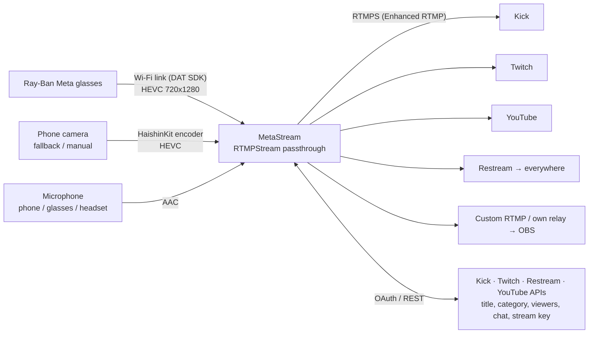

<p align="center">
  
</p>

<h1 align="center">MetaStream</h1>

<p align="center">
  IRL streaming from <b>Ray-Ban Meta</b> glasses to Kick, Twitch, YouTube, Restream or any RTMP server,<br>
  with chat, a stream manager and a phone-camera fallback. Built and signed from <b>Windows</b>. No Mac needed.
</p>

<p align="center">
  <a href="https://github.com/saeedkolivand/meta-stream/actions/workflows/build.yml"></a>
  
  
  
</p>

<p align="center">
  
  
  
</p>

---

## Why this exists

The apps that can talk to Meta glasses (StreamHand, MetaLens) don't show chat, drop the glasses the moment you
switch apps, and can't manage your broadcast. The apps that do all that (Streamlabs) can't see the glasses.
MetaStream fills that gap. I wrote it for my own streams and published it so others can build their own copy.

## What it does

| | |
|---|---|
| **Glasses video** | Official Meta *Wearables Device Access Toolkit*; compressed HEVC straight from the glasses, 720×1280 up to 30 fps |
| **Keeps streaming in the background** | Check chat, answer a text or open Maps. The stream keeps going |
| **Zero re-encoding** | HEVC is passed through to RTMP untouched, so the phone stays cool and the battery lasts |
| **Phone-camera fallback** | When the glasses disconnect, the back or front camera takes over within 2 s with the same codec, so the stream doesn't restart. You can also switch manually |
| **Chat** | Kick, Twitch, YouTube or Restream chat in a slide-up sheet over the preview |
| **Stream Manager** | Log in to Kick / Twitch / Restream / YouTube inside the app: edit title & category, see viewers, send chat, pull your stream key automatically |
| **Destinations** | Presets for Kick, Twitch, YouTube, Restream; Instagram, TikTok and any custom RTMP/RTMPS |
| **Controls** | Go Live / End, mic mute, camera off (black frames), photo capture to Photos, quality, bitrate, mic picker, keep-awake, live HUD with fps / kbps / timer |

### Limits you should know

- **720×1280 portrait @ 30 fps max.** That is the SDK's ceiling for every third-party app.
- **Twitch accepts HEVC only from Affiliates/Partners.** Everyone else: stream to Restream (it re-encodes to H.264) or to your own relay.
- **Paid Apple Developer team required** for the build. See [Why a paid Apple team](#why-a-paid-apple-team).
- One third-party app can be registered with the glasses at a time; registering MetaStream unregisters e.g. StreamHand.
- Glasses microphone is Bluetooth HFP (8 kHz). Default is the phone mic; pick any input in Settings.

## How it works



Everything is one SwiftUI app: `Streamer.swift` (glasses + RTMP + fallback), `Platforms.swift` (logins and APIs),
`ContentView.swift` / `SettingsView.swift` / `StreamManagerView.swift` (UI). There is no server. Platform tokens
stay on the phone.

---

## Build your own copy

You need: a pair of Ray-Ban Meta (Gen 1/2, Display, Oakley Meta), an iPhone on iOS 17.2+, the Meta AI app, a
GitHub account, and access to a **paid Apple Developer team** (yours, or a friend who exports a development
certificate for you). No Mac is required at any point. GitHub's macOS runners do the compiling.

### 1. Fork and rename

Fork this repo. Pick a bundle ID (**no hyphens**, Meta rejects them) and replace `com.saeedkolivand.metastream` in
`project.yml`, `MetaStream/Info.plist` and `MetaStream/Platforms.swift`. Replace `metastream.iamsaeed.dev` in
`Platforms.swift` with your redirect page host (step 5).

### 2. Meta Wearables Developer Center

1. Sign up at <https://wearables.developer.meta.com> and create a project. Bundle ID = yours, Apple Team ID = the paid
   team's ID, Universal link = `metastream://`. Enable the **Camera** permission with a rationale.
2. Copy **MetaAppID** and **ClientToken** (shown under *Application ID*).
3. In the Meta AI app: *Settings → App Info → tap the version 5× → Developer Mode on*. Glasses firmware ≥ v126, Meta AI ≥ V282.

### 3. Apple signing (the paid-team part)

In <https://developer.apple.com/account> → Certificates, Identifiers & Profiles:

1. **Devices** → register your iPhone's UDID (`pip install pymobiledevice3` → `pymobiledevice3 usbmux list`).
2. **Identifiers** → App ID with your bundle ID; enable **Access Wi-Fi Information** and **Hotspot**.
3. **Profiles** → *iOS App Development* profile for that App ID, your device, an Apple Development certificate → download.
4. Export that certificate **with its private key** from Keychain Access as a `.p12`.

### 4. Platform apps (optional, one per platform you want in Stream Manager)

| Platform | Where | Settings |
|---|---|---|
| Kick | kick.com → Settings → Developer (2FA required) | Redirect `https://<your-redirect-host>/oauth.html`, all scopes |
| Twitch | <https://dev.twitch.tv/console> | Redirect `http://localhost`, client type **Public** (device-code login, no secret) |
| Restream | <https://developers.restream.io/apps> | Redirect `https://<your-redirect-host>/oauth.html`, all permissions |
| YouTube | <https://console.cloud.google.com> | Enable *YouTube Data API v3*; OAuth consent screen (Testing, add yourself as test user); OAuth client of type **iOS** with your bundle ID |

### 5. Redirect page

Kick and Restream require an `https` redirect. `docs/oauth.html` is a static page that sends the browser back
into the app. Serve it with GitHub Pages (*Settings → Pages → Deploy from branch → `main` `/docs`*), optionally
behind a custom domain (add a `CNAME` record → `<you>.github.io`, **DNS only**).

### 6. Secrets

*Settings → Secrets and variables → Actions* in your fork:

| Secret | Value |
|---|---|
| `META_APP_ID`, `CLIENT_TOKEN` | from step 2 |
| `TEAM_ID` | the paid team's 10-character Team ID |
| `P12_BASE64`, `P12_PASSWORD` | `base64 -w0 cert.p12`, and its export password |
| `PROVISIONING_PROFILE_BASE64` | `base64 -w0 profile.mobileprovision` |
| `IPA_PASSWORD` | any long random string; encrypts the build artifact (public repo) |
| `KICK_CLIENT_ID`, `KICK_CLIENT_SECRET`, `TWITCH_CLIENT_ID`, `RESTREAM_CLIENT_ID`, `RESTREAM_CLIENT_SECRET`, `YOUTUBE_CLIENT_ID` | from step 4, only the ones you created |

### 7. Build and install (from Windows, Linux or macOS)

Push to `main` or run the *build-ipa* workflow. Then:

```bash
pip install pymobiledevice3                      # once
gh run download -n MetaStream-ipa -D build       # latest artifact
openssl enc -d -aes-256-cbc -pbkdf2 -in build/MetaStream.ipa.enc -out build/MetaStream.ipa -pass pass:'<IPA_PASSWORD>'
pymobiledevice3 apps install build/MetaStream.ipa   # phone unlocked, on USB
```

First launch: *Settings → General → VPN & Device Management → trust the developer*. The development profile is valid
for a year; rebuilds install over the previous version and keep your settings.

---

## Using it

1. **Register** (first-run card) → approve in Meta AI → back in the app.
2. **Manage** pill → connect a platform → *Use for streaming* fills the RTMP URL, stream key and chat for you.
   Or type them in **Settings**.
3. **Glasses** button → LED on, preview live. **GO LIVE**.
4. Top pills: tap the source pill to cycle *auto → glasses → back camera → front camera*; tap mic / cam to mute or
   black out; tap the glasses pill for raw diagnostics.
5. **Chat** button slides chat over the preview. Settings has quality (resolution / fps), bitrate for phone-camera
   video, microphone, fallback camera, keep-awake.

## Why a paid Apple team

Since DAT SDK 0.8 the glasses send video over a direct Wi-Fi link. Joining it needs two entitlements,
`com.apple.developer.networking.HotspotConfiguration` and `com.apple.developer.networking.wifi-info`, which Apple only
grants to paid teams. A build signed with a free Apple ID (Sideloadly, AltStore) registers and connects over
Bluetooth but never receives a frame. This is Apple's rule, and the app can't work around it.

## Troubleshooting

| Symptom | Cause / fix |
|---|---|
| Glasses pill stuck on *connecting*, frames 0 | The build was signed with a free Apple ID and lacks the Wi-Fi entitlements. See above. |
| *Device unavailable* right after start | Known SDK bug ([#292](https://github.com/facebook/meta-wearables-dat-ios/issues/292)) on 0.9.0 + some firmware. Try `exactVersion: 0.8.0` in `project.yml`. |
| *Internal error* during Meta registration | Known on iPhone 17e / iOS 26.5.1 ([#205](https://github.com/facebook/meta-wearables-dat-ios/issues/205)). |
| Relay/OBS shows nothing | Stream key empty? Any non-empty key works for your own server. Check the server accepts Enhanced-RTMP HEVC (FFmpeg ≥ 6.1 does). |
| Kick login page opens the Kick app instead | A universal-link quirk. Long-press the link and open it in the browser, or retry. |
| Twitch rejects the stream | Non-Affiliate accounts don't accept HEVC. Use Restream or a relay that transcodes. |
| Ingest connects but shows offline, or OBS stays blank | The destination refused HEVC. Set the codec to H.264 in Settings (Auto already does this for Kick and Twitch). |
| Stream freezes when you leave the app in H.264 mode | iOS stops the hardware decoder in the background. Keep the Picture in Picture window open, or send HEVC to Restream or your own relay instead. |

## Security notes

- The `signing/` folder (certificate, profile, client-ID files, IPA password) is gitignored. Never commit it.
- Build artifacts are encrypted because anyone with a GitHub account can download public-repo artifacts and the IPA
  embeds OAuth client secrets. Development-signed IPAs only install on the UDIDs in the profile anyway.
- Platform tokens and stream keys are stored in `UserDefaults` on the phone (single-user app). Move them to the
  Keychain if you share the device.

## Roadmap

Chat read aloud through the glasses, local HEVC recording, SRT output, several destinations from the phone, and an
H.264 mode for Twitch accounts without Affiliate status.

## Credits

[Meta Wearables Device Access Toolkit](https://github.com/facebook/meta-wearables-dat-ios) ·
[HaishinKit](https://github.com/HaishinKit/HaishinKit.swift) · [XcodeGen](https://github.com/yonaskolb/XcodeGen) ·
[pymobiledevice3](https://github.com/doronz88/pymobiledevice3).
Built by [Saeed Kolivand](https://iamsaeed.dev) with Claude Code.
